# Audio-to-AUTD Signal Conversion / 音频到 AUTD 触觉信号转换说明

本文档说明 `FrictionAUTD` 如何把摩擦 / 抚摸 / 刮擦类音频转换成 UltraSleep 18 台 AUTD 上的左右同步焦点运动信号。当前实现不使用 AudioSep，也不做声音事件分离；音频特征分析逻辑保持不变。

This document explains how `FrictionAUTD` converts rubbing audio into synchronized left/right focus motion on UltraSleep's 18-device AUTD geometry. Audio analysis is unchanged and still uses `librosa` without AudioSep.

## 1. Overall Pipeline / 总体流程

```text
WAV audio clip
  -> librosa analysis
  -> framewise feature curves
  -> friction_motion.json
  -> time interpolation during playback
  -> synchronized left/right GainSTM generation
  -> UltraSleep AUTDManager Group send (devices 0-8 / 9-17)
  -> synchronized audio playback
```

中文流程解释：

- 输入是一段 WAV 音频，例如 `audio_files/asmr_friction_01h22m01s_01h22m20s.wav`。
- `friction_analyze.py` 每隔 `50 ms` 生成一组音频特征。
- 每一帧特征被转换成 AUTD 控制参数，并写入 `analysis/*_friction_motion.json`。
- `friction_play.py` 运行时读取 JSON，根据当前播放时间插值出一帧 `MotionFrame`。
- 程序用这帧参数构造左右两条同步 `GainSTM`，通过 UltraSleep 的 9+9 分组发送给 18 台 AUTD。
- 第一帧触觉发送成功后，立刻启动音频播放，使触觉和听觉尽量同步。

English pipeline explanation:

- The input is a WAV clip, such as `audio_files/asmr_friction_01h22m01s_01h22m20s.wav`.
- `friction_analyze.py` extracts features every `50 ms`.
- Each feature frame is mapped to AUTD control parameters and written into `analysis/*_friction_motion.json`.
- During playback, `friction_play.py` samples the JSON by the current audio time and interpolates a `MotionFrame`.
- The program builds synchronized left/right `GainSTM` sequences and sends them through UltraSleep's 9+9 device grouping.
- Audio playback starts immediately after the first haptic frame is sent successfully, so tactile and auditory cues start together.

## 2. Current Clips / 当前使用的音频片段

| Clip | Audio file | Duration | JSON points | Mean intensity | Cycle range |
|---|---|---:|---:|---:|---:|
| Original / 原始片段 | `audio_files/asmr_friction_01h22m01s_01h22m20s.wav` | `19.0 s` | `379` | `159.1` | `0.60-3.00 Hz` |
| Slow 0.5x / 慢速 0.5x | `audio_files/asmr_friction_01h22m01s_01h22m20s_slow_0p5x.wav` | `38.0 s` | `759` | `146.5` | `0.67-2.89 Hz` |

慢速版本使用 `librosa.effects.time_stretch(rate=0.5)` 生成，目标是把速度放慢一倍，同时保持音高不随之降低。

The slow version was generated with `librosa.effects.time_stretch(rate=0.5)`, which doubles the duration while preserving pitch.

## 3. Audio Feature Extraction / 音频特征提取

分析脚本使用的默认参数：

Default analysis parameters:

```text
analysis sample rate = 22050 Hz
frame size           = 100 ms
hop size             = 50 ms
amplitude floor      = -55 dB
amplitude ceiling    = -12 dB
cycle_hz clamp       = 0.25-3.0 Hz
stroke length range  = 30-90 mm
max jitter           = 4 mm
height               = 100 mm
```

### 3.1 Loudness / 音量强度

首先用 `librosa.feature.rms` 计算 RMS 能量，再转成 dB：

First, RMS energy is computed with `librosa.feature.rms`, then converted to dB:

```text
db = amplitude_to_db(rms, ref=1.0)
normalized_amplitude = clamp((db - floor_db) / (ceiling_db - floor_db), 0, 1)
```

这里的 `normalized_amplitude` 表示当前音频强度在 `0..1` 之间的位置。它是后续 AUTD 强度和焦点移动距离的主要来源。

Here, `normalized_amplitude` represents the frame loudness on a `0..1` scale. It is the main source for AUTD intensity and stroke length.

原始片段的音量变化：

Original clip loudness:

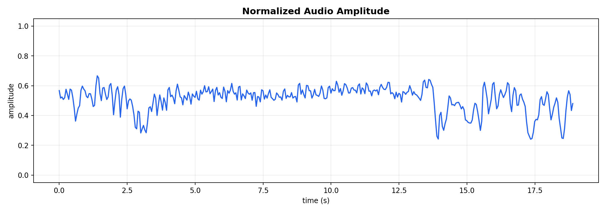

慢速片段的音量变化：

Slow clip loudness:

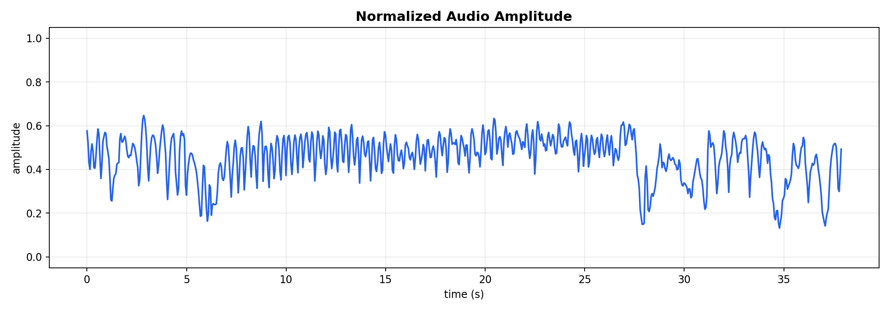

### 3.2 Friction Pulses / 摩擦脉冲

摩擦声常常不是一个完全平滑的音量包络，而是包含许多细碎的触碰、刮擦、回拉脉冲。因此脚本用 `librosa.onset.onset_strength` 计算 onset strength，并用峰值间隔估计局部脉冲频率。

Friction sounds are not only smooth loudness envelopes. They often contain many small contacts, scratches, and return-stroke pulses. Therefore, the script uses `librosa.onset.onset_strength` and estimates local pulse rate from peak intervals.

```text
pulse_hz = 1 / interval_between_onset_peaks
cycle_hz = clamp(pulse_hz / onset_divisor, min_cycle_hz, max_cycle_hz)
```

默认 `onset_divisor = 2`，因为很多摩擦声中一次声学脉冲更接近“半个往返动作”，而 AUTD 的 `cycle_hz` 表示完整的左-右-左循环。

The default `onset_divisor = 2` because one acoustic pulse often corresponds to roughly half of a back-and-forth stroke, while AUTD `cycle_hz` means a full left-right-left cycle.

原始片段的音量与 onset 脉冲：

Original amplitude and onset pulses:

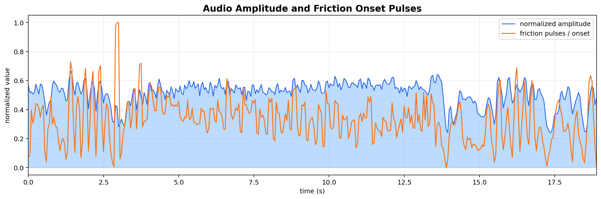

慢速片段的音量与 onset 脉冲：

Slow amplitude and onset pulses:

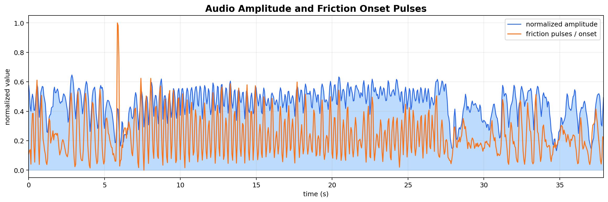

### 3.3 Spectral Roughness / 频谱粗糙度

摩擦声的“粗糙感”不仅来自音量，也来自频谱。脚本计算：

The perceived roughness of friction is not only loudness; it is also spectral. The script computes:

- `spectral_centroid_hz`：频谱重心，越高通常越尖锐。
- `spectral_bandwidth_hz`：频谱带宽，越大通常越散、越粗糙。
- `roughness`：把二者归一化后加权合成。

- `spectral_centroid_hz`: spectral centroid, usually higher for sharper sounds.
- `spectral_bandwidth_hz`: spectral bandwidth, usually larger for broader and rougher sounds.
- `roughness`: a normalized weighted combination of both.

```text
roughness = clamp(0.65 * centroid_norm + 0.35 * bandwidth_norm, 0, 1)
jitter_mm = roughness * max_jitter_mm
```

这个 `jitter_mm` 最后会变成焦点轨迹上的轻微横向扰动，用来模拟摩擦表面的细碎不均匀。

This `jitter_mm` becomes a small lateral perturbation on the focus path, representing small uneven textures in the friction surface.

原始片段的粗糙度和频谱重心：

Original roughness and spectral centroid:

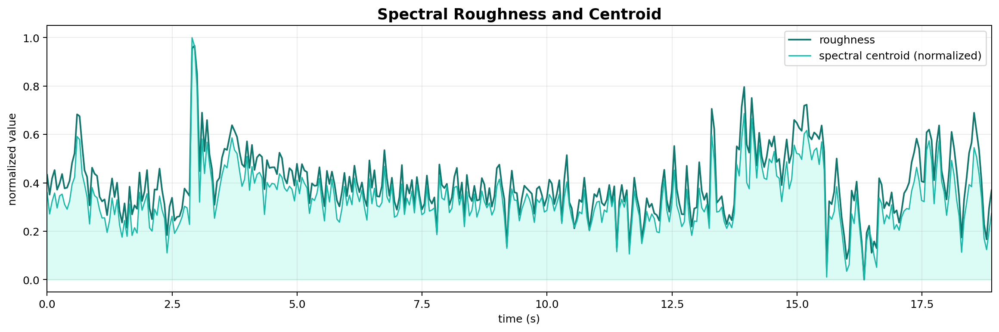

慢速片段的粗糙度和频谱重心：

Slow roughness and spectral centroid:

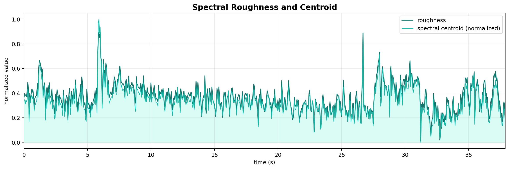

## 4. Mapping Features to AUTD Parameters / 从音频特征到 AUTD 参数

每个时间点最终会生成一条 `motion_curve` 记录，核心字段如下：

Each time point becomes one `motion_curve` record. The core fields are:

```json
{
  "time_s": 1.25,
  "normalized_amplitude": 0.62,
  "onset_normalized": 0.41,
  "roughness": 0.45,
  "intensity": 183,
  "cycle_hz": 0.74,
  "length_mm": 67.2,
  "height_mm": 100.0,
  "jitter_mm": 1.8
}
```

### 4.1 Intensity / 强度

AUTD 强度来自归一化音量，但不是简单线性映射，而是使用 `0.7` 次幂让中等音量更容易产生可感知触觉：

AUTD intensity is derived from normalized loudness, but not linearly. A `0.7` power curve makes medium-level audio easier to feel:

```text
intensity = round(normalized_amplitude ** 0.7 * 255)
```

原始片段强度：

Original intensity:

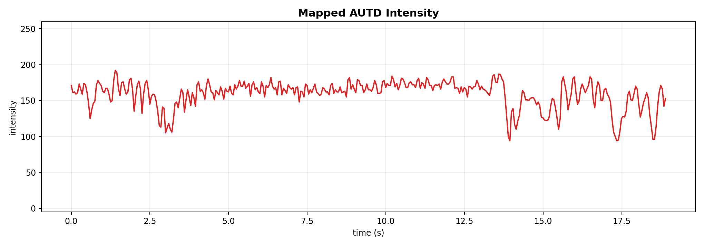

慢速片段强度：

Slow intensity:

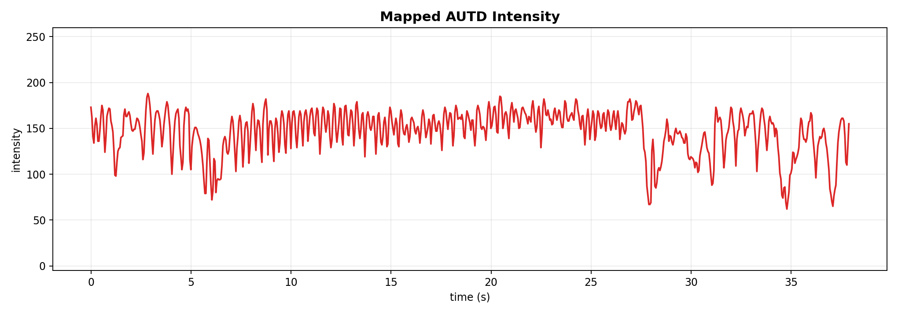

### 4.2 Cycle Speed / 来回运动速度

`cycle_hz` 控制焦点完整左-右-左往返的速度。它主要由 onset 峰值间隔估计出来：

`cycle_hz` controls the full left-right-left back-and-forth speed of the focus. It mainly comes from onset peak intervals:

```text
cycle_hz = onset_peak_rate / onset_divisor
cycle_hz is clamped to 0.25-3.0 Hz
```

原始片段速度：

Original cycle speed:

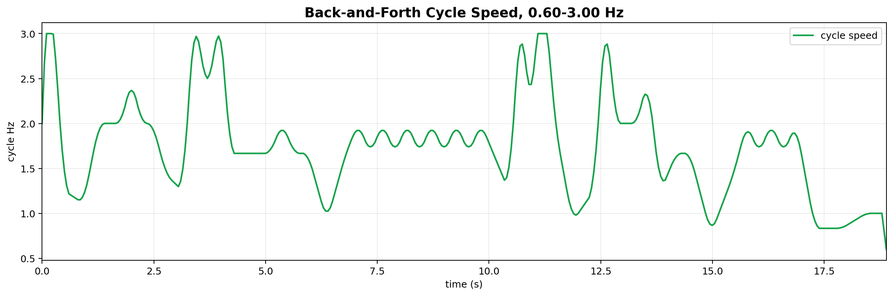

慢速片段速度：

Slow cycle speed:

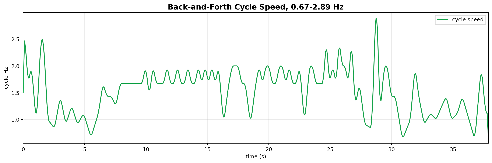

### 4.3 Stroke Length / 往返距离

焦点往返距离跟音量相关。声音越强，焦点移动范围越大：

Stroke length is tied to loudness. Louder friction produces a wider focus motion:

```text
length_mm = min_length_mm + normalized_amplitude * (max_length_mm - min_length_mm)
          = 30 + normalized_amplitude * 60
```

原始片段往返距离：

Original stroke length:

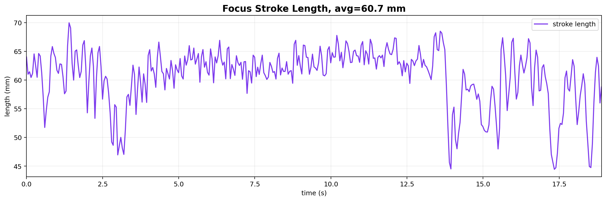

慢速片段往返距离：

Slow stroke length:

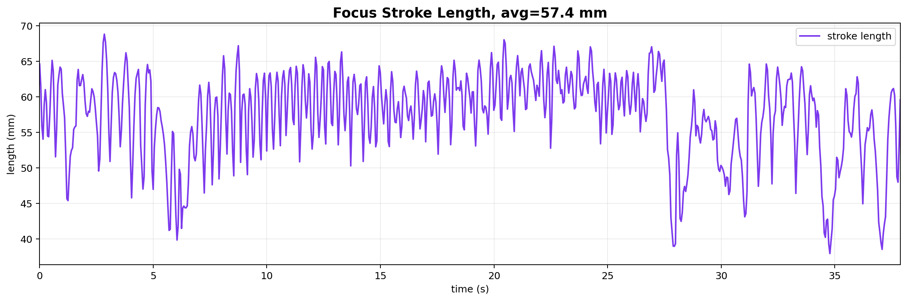

### 4.4 Jitter / 路径抖动

路径抖动由频谱粗糙度控制。它不是完全随机跳动，而是在播放时生成平滑的横向扰动：

Path jitter is controlled by spectral roughness. It is not framewise random jumping; during playback it becomes a smooth lateral perturbation:

```text
jitter_mm = roughness * 4.0
```

原始片段路径抖动：

Original path jitter:

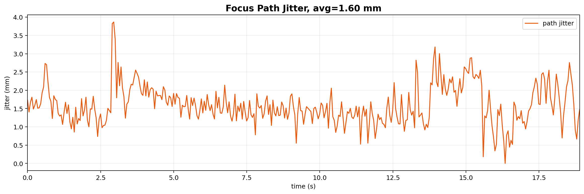

慢速片段路径抖动：

Slow path jitter:

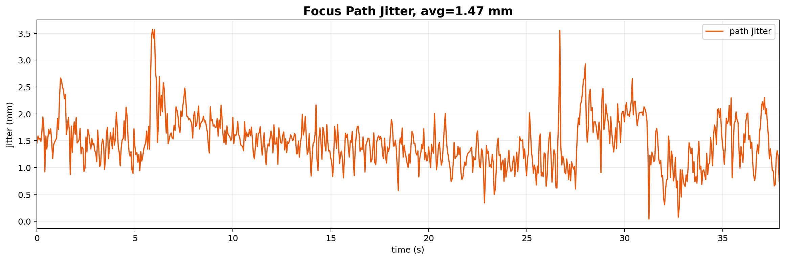

## 5. JSON Timeline / JSON 时间线结构

分析输出 JSON 主要包含四块：

The analysis JSON mainly contains four parts:

```text
source_path      original WAV path
duration_s       clip duration
summary          global statistics
motion_curve     frame-by-frame control timeline
```

`motion_curve` 是最重要的部分。它是一个按时间排序的列表，每个元素对应一个分析帧。播放时并不要求 AUTD 正好只在这些离散时间点更新；`friction_play.py` 会根据当前播放时间做线性插值。

`motion_curve` is the most important part. It is a time-sorted list where each element corresponds to one analysis frame. Playback is not restricted to these exact timestamps; `friction_play.py` linearly interpolates values by the current audio time.

```text
MotionTimeline.sample(time_s)
  -> intensity
  -> cycle_hz
  -> length_mm
  -> height_mm
  -> jitter_mm
```

## 6. Generating the AUTD Focus Motion / 生成 AUTD 焦点运动

运行时，每个插值得到的 `MotionFrame` 会被转换成左右两条同步往返运动 STM。默认坐标与 UltraSleep 实验工作区一致：

At runtime, each interpolated `MotionFrame` becomes synchronized right/left STM motion in UltraSleep's working regions:

```text
z = base_z_mm + height_mm = 250 + 100 = 350
right_center = [0, 100, z] + DEVICE_CENTER_RIGHT
left_center  = [0, -100, z] + DEVICE_CENTER_LEFT
```

### 6.1 Eased Back-and-Forth Path / 带端点减速的来回轨迹

焦点沿 x 方向来回移动，使用余弦轨迹：

The focus moves along the x-axis with a cosine trajectory:

```text
x = -0.5 * length_mm * cos(theta)
```

这条轨迹的特点是：

- 在左右端点速度为 0；
- 离开端点后自然加速；
- 到中间速度最大；
- 接近另一端时自然减速。

This trajectory has these properties:

- zero velocity at both endpoints;
- natural acceleration after leaving an endpoint;
- maximum velocity near the center;
- natural deceleration near the opposite endpoint.

这正好适合模拟“来回摩擦 / 抚摸”的动作。

This is suitable for simulating back-and-forth rubbing or stroking.

### 6.2 Smooth Roughness Perturbation / 平滑粗糙扰动

为了让触感不只是机械直线运动，播放时把 `jitter_mm` 加到 y 方向：

To avoid a perfectly mechanical straight line, playback adds `jitter_mm` to the y-direction:

```text
y = jitter_mm * (0.65 * sin(3 * theta) + 0.35 * sin(7 * theta + 0.7))
```

这会产生平滑但不完全单调的横向微扰，模拟摩擦声中的细碎纹理。

This creates a smooth but non-monotonic lateral perturbation, representing fine texture in the rubbing sound.

原始片段估计焦点位置：

Original estimated focus motion:

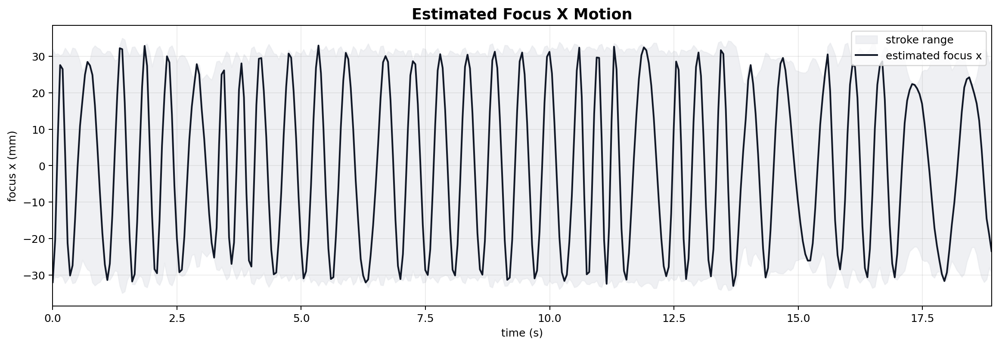

慢速片段估计焦点位置：

Slow estimated focus motion:

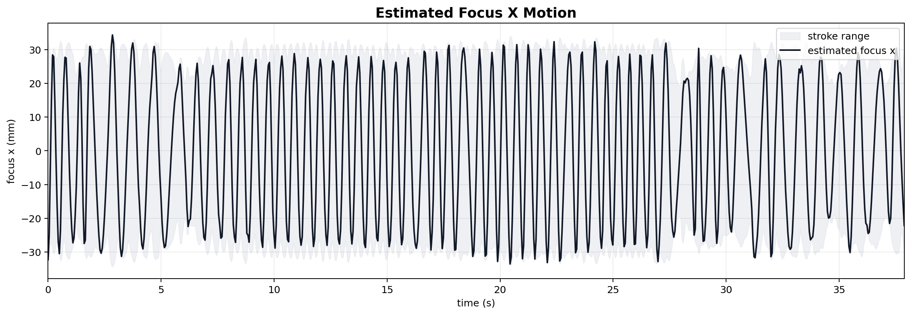

焦点速度也可单独查看：

Focus speed can also be inspected separately:

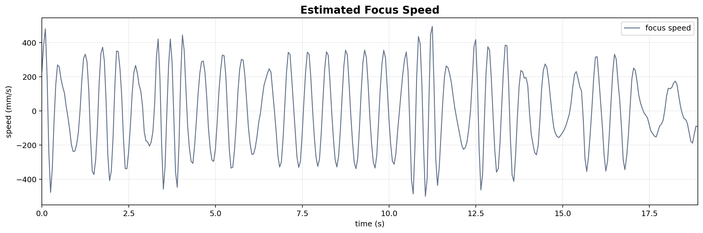

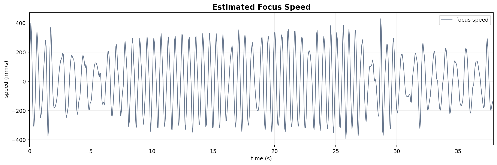

## 7. Building the AUTD Datagram / 构造 AUTD Datagram

每个 STM frame 是一个带当前音频强度的 `Focus`：

Each STM frame is a `Focus` carrying the current audio-derived intensity:

```text
Focus(point, FocusOption(intensity=EmitIntensity(intensity)))
```

左右两组焦点序列分别构成 `GainSTM`，再由复制自 UltraSleep 的 `AUTDManager` 同时发送：

The two focus sequences become `GainSTM` instances and are sent together by UltraSleep's copied `AUTDManager`:

```text
gain_right = GainSTM(gains=right_frames, config=SamplingConfig(divide), ...)
gain_left  = GainSTM(gains=left_frames,  config=SamplingConfig(divide), ...)
autd.perform_double_irradiate(g1=gain_right, g2=gain_left, m=Static())
```

这里的 `Static()` 表示不额外叠加 AM 包络调制；触感主要来自焦点的空间运动和强度变化。

Here, `Static()` means no extra AM envelope modulation is applied. The tactile change mainly comes from spatial focus motion and intensity variation.

### 7.1 STM Timing Constraint / STM 采样约束

AUTD 要求 STM 采样频率必须能整除超声频率 `40000 Hz`。因此程序不会直接使用任意 `cycle_hz`，而是自动选择接近目标的合法组合：

AUTD requires the STM sampling frequency to divide the ultrasound frequency `40000 Hz`. Therefore, the program does not use arbitrary `cycle_hz` directly; it selects a nearby valid timing:

```text
sampling_hz = frame_count * actual_cycle_hz
40000 % sampling_hz == 0
divide = 40000 / sampling_hz
```

这样可以避免：

This avoids:

```text
Sampling frequency (...) must divide the ultrasound frequency
```

## 8. Synchronized Audio Playback / 触觉与音频同步播放

同步策略是：

The synchronization strategy is:

```text
prepare audio player
open AUTD
send first haptic STM
start audio immediately
continue AUTD update loop
```

当前默认音频后端是 `afplay`：

The default audio backend is `afplay`:

```toml
[audio]
backend = "afplay"
```

原因是 `sounddevice` 需要 Python callback 持续向声卡送数据；真实 AUTD 运行时 `autd.send()` 可能占用 Python 调度，导致音频卡顿。`afplay` 是 macOS 系统播放器进程，不依赖 Python callback，因此更稳定。

The reason is that `sounddevice` needs a Python callback to feed audio buffers continuously. During real AUTD playback, `autd.send()` can occupy Python scheduling and cause audio glitches. `afplay` is a macOS system audio process, so it is more stable for synchronized tests.

## 9. Commands / 常用命令

重新分析并生成每种图片：

Re-analyze and generate separate figures:

```bash
cd /Users/mikieteriri/proj/AUTDtest/FrictionAUTD
../.venv/bin/python friction_analyze.py \
  --wav audio_files/asmr_friction_01h22m01s_01h22m20s.wav \
  --plot
```

只根据已有 JSON 重新生成可视化图片：

Regenerate visualizations from an existing JSON:

```bash
cd /Users/mikieteriri/proj/AUTDtest/FrictionAUTD
../.venv/bin/python friction_visualize.py \
  --json analysis/asmr_friction_01h22m01s_01h22m20s_friction_motion.json
```

运行原始片段：

Run the original clip:

```bash
cd FrictionAUTD
python friction_play.py
```

运行慢速片段：

Run the slow clip:

```bash
cd FrictionAUTD
python friction_play.py \
  --json analysis/asmr_friction_01h22m01s_01h22m20s_slow_0p5x_friction_motion.json \
  --wav audio_files/asmr_friction_01h22m01s_01h22m20s_slow_0p5x.wav
```

## 10. What Each Image Means / 每张图片的含义

| File | 中文含义 | English meaning |
|---|---|---|
| `01_normalized_amplitude.png` | 归一化音量，决定强度和移动距离的主要曲线 | Normalized loudness, the main driver of intensity and stroke length |
| `02_autd_intensity.png` | 映射后的 AUTD 强度 | Mapped AUTD intensity |
| `03_cycle_hz.png` | 根据 onset 估计的往返速度 | Back-and-forth speed estimated from onset rhythm |
| `04_stroke_length_mm.png` | 根据音量映射的移动距离 | Stroke length mapped from loudness |
| `05_jitter_mm.png` | 根据频谱粗糙度映射的路径抖动 | Path jitter mapped from spectral roughness |
| `06_audio_amplitude_and_onset.png` | 音量和摩擦脉冲放在一起看 | Loudness and friction pulses shown together |
| `07_visual_autd_intensity.png` | 更直观的强度填充图 | A more visual filled intensity plot |
| `08_cycle_speed_hz.png` | 更直观的速度图 | A more visual cycle-speed plot |
| `09_stroke_length_mm.png` | 更直观的距离图 | A more visual stroke-length plot |
| `10_roughness_and_spectral_centroid.png` | 频谱粗糙度与频谱重心 | Spectral roughness and spectral centroid |
| `11_path_jitter_mm.png` | 触觉路径抖动量 | Tactile path jitter amount |
| `12_estimated_focus_x_motion.png` | 估计的焦点 x 方向运动轨迹 | Estimated focus x-position trajectory |
| `13_estimated_focus_speed.png` | 估计的焦点运动速度 | Estimated focus speed |

## 11. Current Limitations / 当前限制

中文：

- 该流程假设输入就是摩擦类音频，不负责从复杂混音中检测或分离摩擦声。
- `cycle_hz` 是根据 onset 峰值估计的局部节奏，不一定等同于真实物体运动速度。
- `roughness -> jitter_mm` 是启发式映射，需要根据主观触感继续调参。
- 当前每个工作区使用一个移动焦点。如果要模拟更宽的接触面，可以扩展成多焦点或小焦点团。

English:

- The pipeline assumes the input is friction-like audio; it does not detect or separate friction from complex mixtures.
- `cycle_hz` is estimated from onset peaks and may not equal the real physical rubbing speed.
- `roughness -> jitter_mm` is a heuristic mapping and should be tuned by subjective tactile feedback.
- Each work region currently uses one moving focus. Wider contact can be implemented with multi-focus patterns or focus clusters.

## 12. Summary / 总结

一句话总结：

In one sentence:

```text
音频强度决定 AUTD 强度和移动距离，
摩擦脉冲决定焦点往返速度，
频谱粗糙度决定路径抖动，
最终生成左右两条与声音同步播放的来回运动焦点。

Audio loudness controls AUTD intensity and stroke length;
friction pulses control back-and-forth speed;
spectral roughness controls path jitter;
the final output is synchronized moving focuses in the two UltraSleep work regions.
```
